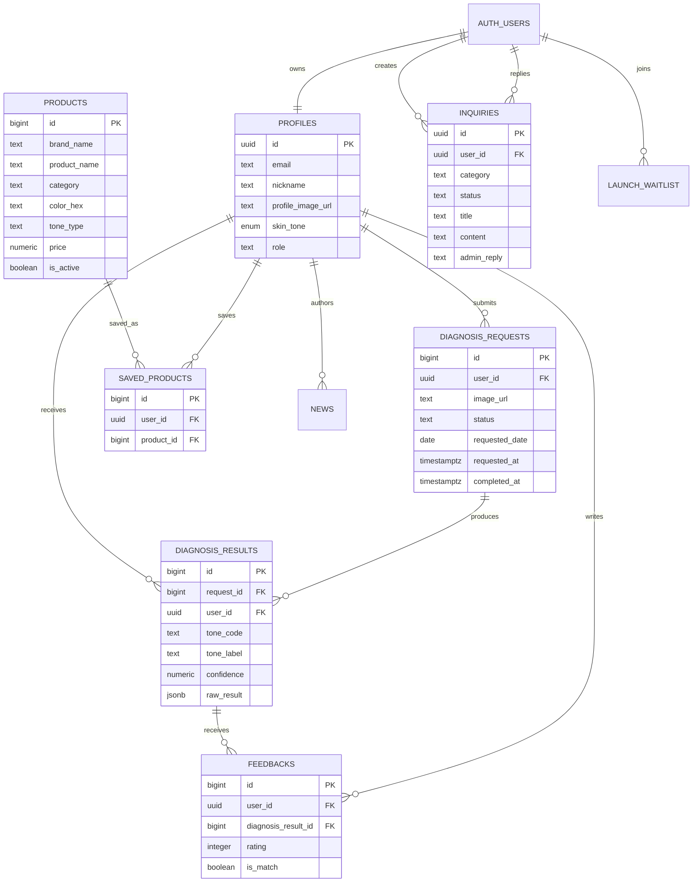
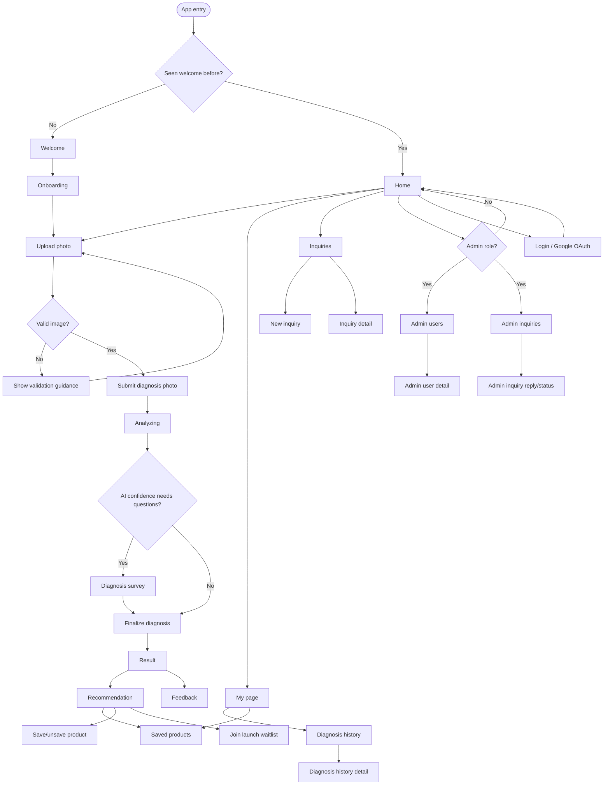

# Architecture

## Overview

WINGS Frontend is a Next.js App Router application for personal color diagnosis, recommendation, saved products, support inquiries, and admin review workflows.

- Framework: Next.js App Router with React components.
- Styling: Tailwind CSS v4 tokens in `src/index.css`.
- Auth and data: Supabase Auth, tables, and edge/API endpoints.
- AI diagnosis: client uploads an image, calls diagnosis API routes, persists diagnosis request/result, and optionally asks follow-up survey questions.
- Product recommendation: maps the user's personal color season to recommended and saved products.

## Source Layout

| Path | Role |
| --- | --- |
| `src/app` | Next.js route tree. Route files are thin wrappers around views. |
| `src/views` | Page-level client UI for onboarding, diagnosis, recommendation, account, inquiry, and admin flows. |
| `src/api` | Client adapters for Supabase, app API routes, auth, products, diagnosis, feedback, inquiries, and waitlist. |
| `src/lib` | Shared helpers including Supabase client and router compatibility helpers. |
| `src/constants` | Tone metadata, inquiry labels, product constants. |
| `src/types` | Supabase and diagnosis TypeScript types. |
| `public/mediapipe` | Mediapipe WASM runtime files used by image validation. |

## Route Map

| Route | View | Purpose |
| --- | --- | --- |
| `/` | `Welcome` | Splash/welcome entry. |
| `/onboarding` | `Onboarding` | Product promise and CTA into diagnosis. |
| `/photo` | `UploadPhoto` | Capture/upload diagnosis photo. |
| `/analyzing` | `Analyzing` | Progress UI while AI diagnosis completes. |
| `/diagnosis-survey` | `DiagnosisSurvey` | Optional follow-up questions when confidence is low. |
| `/result` | `Result` | Final personal color result. |
| `/recommendation` | `Products` | Backward-compatible product browsing route. |
| `/products` | `Products` | Product grid with tone/category/search filters and infinite scroll. |
| `/community` | `Community` | Tone-specific gallery board for reviews, questions, and product discussion. |
| `/home` | `Home` | Logged-in landing/home dashboard. |
| `/mypage` | `MyPage` | Profile, account, and history access. |
| `/diagnosis-history` | `DiagnosisHistory` | Diagnosis history list. |
| `/diagnosis-history/[id]` | `DiagnosisHistoryDetail` | Diagnosis result detail. |
| `/tone-products` | `ToneProducts` | Tone-specific product browsing. |
| `/saved-products` | `SavedProducts` | Saved product list. |
| `/news` | `NewsList` | Published news grid with author, title, preview, and thumbnail. |
| `/news/[id]` | `NewsDetail` | PikiCast-style card news detail split from body paragraphs. |
| `/feedback` | `Feedback` | Diagnosis feedback submission. |
| `/login` | `Login` | Google/Supabase OAuth login. |
| `/inquiries` | `Inquiries` | User support inquiry list. |
| `/inquiries/new` | `NewInquiry` | Create support inquiry. |
| `/inquiries/[id]` | `InquiryDetail` | User inquiry detail. |
| `/admin`, `/admin/users` | `AdminUsers` | Admin user list. |
| `/admin/users/[id]` | `AdminUserDetail` | Admin user detail and diagnosis records. |
| `/admin/inquiries` | `AdminInquiries` | Admin inquiry list. |
| `/admin/inquiries/[id]` | `AdminInquiryDetail` | Admin inquiry reply/status editor. |
| `/admin/news/new` | `AdminNewsEditor` | Admin news creation form. |
| `/admin/news/[id]` | `AdminNewsEditor` | Admin news editing form. |

## Data Model

The SQL below is summarized from the attached Supabase schema, with current TypeScript differences noted where relevant.

### Core Tables

| Table | Primary Key | Main Fields | Relations / Notes |
| --- | --- | --- | --- |
| `profiles` | `id uuid` | `email`, `nickname`, `profile_image_url`, `birth_year`, `skin_note`, `skin_tone`, `role` | `id` references `auth.users(id)`. Roles: `user`, `staff`, `admin`. |
| `diagnosis_requests` | `id bigint identity` | `user_id`, `image_url`, `status`, `requested_at`, `requested_date`, `completed_at`, `error_message` | References `profiles(id)`. Current TS also includes `requester_type` and `guest_token_hash`. |
| `diagnosis_results` | `id bigint identity` | `request_id`, `user_id`, `tone_code`, `tone_label`, `confidence`, `raw_result`, `created_at` | References `diagnosis_requests(id)` and `profiles(id)`. |
| `products` | `id bigint identity` | `brand_name`, `product_name`, `product_color`, `category`, `color_hex`, `hue`, `saturation`, `brightness`, `tone_type`, `detailed_tone`, `lip_type`, `texture`, `recommended_skin_type`, `product_image_url`, `price`, `product_url`, `is_active` | SQL includes `primary_tone` and `tone_codes tone[]`; current TS does not expose those fields. |
| `saved_products` | `id bigint identity` | `user_id`, `product_id`, `created_at` | References `profiles(id)` and `products(id)`. |
| `feedbacks` | `id bigint identity` | `user_id`, `diagnosis_result_id`, `rating`, `is_match`, `comment`, `created_at` | Rating constrained to 1-5. References `profiles(id)` and `diagnosis_results(id)`. |
| `launch_waitlist` | `id bigint identity` | `email`, `source`, `tone_code`, `user_id`, `created_at` | `email` is unique. `user_id` references `auth.users(id)`. |
| `inquiries` | `id uuid` | `user_id`, `category`, `title`, `content`, `status`, `admin_reply`, `replied_by`, `replied_at`, `is_deleted` | Categories: `account`, `diagnosis`, `product`, `payment`, `bug`, `etc`. Statuses: `pending`, `in_progress`, `answered`, `closed`. |
| `news` | `id bigint identity` | `title`, `category`, `content`, `author_id`, `is_published`, `published_at`, `thumbnail_url` | `content` stores a card-news JSON document with slides, SEO metadata, and exposure settings. |

### Type-Only / Sync-Check Items

| Object | Source | Note |
| --- | --- | --- |
| `product_tone_tags` | `src/types/supabase.ts` | Present in TS types but not in attached SQL. Likely used for product-to-tone scoring; confirm DB state before relying on it. |
| `feedbacks_result` | `src/types/supabase.ts` | Present in TS types as a table-like object; confirm whether this is a view/table in Supabase. |
| `skin_tone` enum | SQL + TS | Values: `spring`, `summer`, `autumn`, `winter`. |
| `tone` enum | SQL | Used by `products.tone_codes tone[]`; ensure generated TS includes it if frontend reads it. |

## Entity Relationship Diagram

## User Flow

The high-level user flow is based on the supplied flowchart image and the implemented Next routes.

## Diagnosis Flow Details

1. `UploadPhoto` stores a pending photo in memory via `src/api/diagnosisUpload.ts`.
2. `Analyzing` calls diagnosis APIs in `src/api/diagnosis.ts`.
3. The backend returns AI season, Korean label, confidence, probability scores, LAB values, quality metadata, and optional question flags.
4. Low confidence or small top-1/top-2 gap can route to `DiagnosisSurvey`.
5. Final results are persisted into `diagnosis_requests` and `diagnosis_results`, then used by `Result`, `Recommendation`, and `DiagnosisHistory`.
6. Logged-in users can save products, leave feedback, and revisit history.

## Storage

이미지는 Supabase Storage의 버킷 3개로 용도별 분리해 관리합니다.

| 버킷 | 용도 | 경로 형식 | 업로드 위치 |
| --- | --- | --- | --- |
| `news` | 뉴스 카드 이미지, 썸네일 | `YYYY-MM-DD/<uuid>.<ext>` | `src/api/news.ts` → `uploadNewsImage()` |
| `avatars` | 사용자 프로필 사진 | `<user_id>/<uuid>.<ext>` | 향후 프로필 편집 기능 추가 시 |
| `community` | 커뮤니티 게시글 첨부 이미지 | `<user_id>/<uuid>.<ext>` | 향후 게시글 이미지 업로드 시 |

### 규칙

- 버킷은 `news` / `avatars` / `community` 세 가지만 사용합니다. 새 버킷을 임의로 추가하지 않습니다.
- 공개 URL은 `supabase.storage.from("<버킷명>").getPublicUrl(path)` 로 획득합니다.
- 업로드 시 `cacheControl: "31536000"`, `upsert: false` 를 기본으로 설정합니다.

## Operational Notes

- Supabase environment variables should be available as `NEXT_PUBLIC_SUPABASE_URL` and `NEXT_PUBLIC_SUPABASE_PUBLISHABLE_KEY` (with `NEXT_PUBLIC_SUPABASE_ANON_KEY` only as a fallback key name). Legacy `REACT_APP_SUPABASE_*` variables are not used.
- The app currently avoids throwing at import time when Supabase variables are missing, so static builds can complete. Runtime auth/data flows still require valid values.
- Keep generated DB types and the actual Supabase schema in sync after migrations.
- 이미지 업로드는 용도에 따라 `news` / `avatars` / `community` 버킷을 사용합니다. 새 기능에서 이미지를 업로드할 때는 위 버킷 분류와 경로 규칙을 따릅니다.
